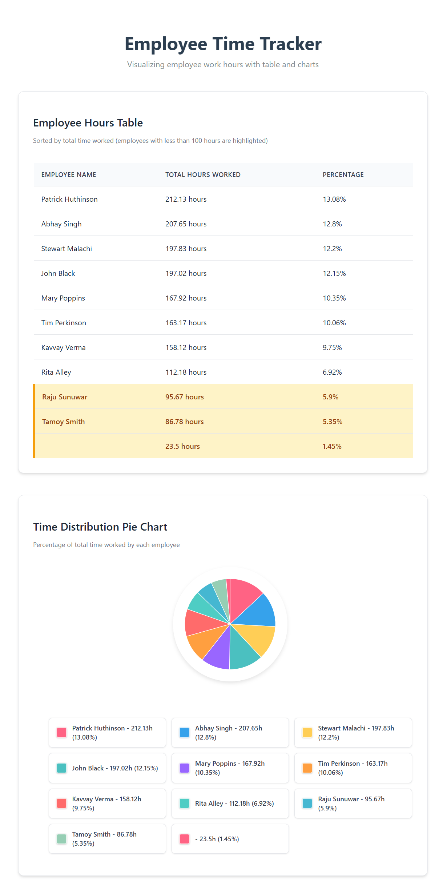

# Employee Time Visualizer using Angular

A modern Angular application that visualizes employee time entry data through interactive tables and pie charts. Built with Angular 18+ using standalone components for optimal performance and maintainability.

## 🚀 Features

- **Interactive Data Table**: Displays employee names, total hours worked, and percentages
- **Smart Highlighting**: Automatically highlights employees with less than 100 hours in amber
- **SVG Pie Chart**: Clean, responsive pie chart with thin borders for clear slice separation
- **Color-Coded Legend**: Matching colors between chart slices and legend items
- **Responsive Design**: Optimized for desktop, tablet, and mobile devices
- **Error Handling**: Robust error handling with retry functionality
- **Mock Data Fallback**: Graceful fallback to sample data if API is unavailable

## 📊 Demo

The application fetches employee time data and presents it in two formats:
1. **Sortable Table**: Employees sorted by total hours (descending)
2. **Pie Chart**: Visual representation of time distribution percentages

## 📸 Screenshots

### Main Dashboard

*The main dashboard showing both the employee hours table and interactive pie chart side by side*

---

